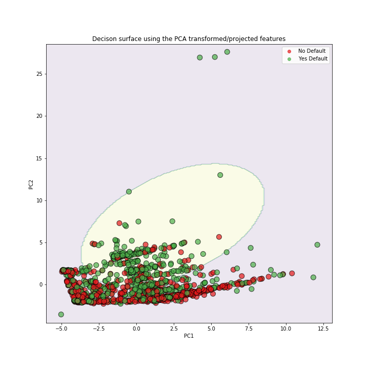

# Support Vector Machines in Python, End to End Machine Learning Problem
#### Tattwa Darshi Panda, Data Scientist, Hong Kong

----

In this project we will build a **Support Vector Machine** for **classification** using **scikit-learn** and the **Radial Basis Function (RBF) Kernel**. Our training data set contains continuous and categorical data from the **[UCI Machine Learning Repository](https://archive.ics.uci.edu/ml/index.php)** to predict whether or not a person will **[default on their credit card](https://archive.ics.uci.edu/ml/datasets/default+of+credit+card+clients)**.

**Support Vector Machines** are one of the best machine learning methods when getting the correct answer is a higher priorty than understanding why you get the correct answer. They work really well with relatively small datasets and they tend to work well "out of the box". In other words, they do not require much optimization.

In this project we will do the following:

- **[Importing Data from a File](#download-the-data)**

- **[Missing Data](#identify-and-deal-with-missing-data)**

    - Identifying Missing Data
    - Dealing with Missing Data

- **[Downsampling Data](#downsample-the-data)**
    
- **[Formatting the Data for Support Vector Machines](#format-the-data)**

    - Splitting data into Dependent and Independent Variables
    - One-Hot-Encoding
    - Centering and Scaling the Data
    

- **[Building a Preliminary Support Vector Machine](#build-svm)**

- **[Opimizing Parameters with Cross Validation](#optimize-svm)**
    - Using Cross Validation to find the best Values for Gamma and Regularization

- **[Building, Evaluating, Drawing and Interpreting the Final Support Vector Machine](#draw-svm)**

# Import the modules that will do all the work
The very first thing we do is load in a bunch of python modules. Python, itself, just gives us a basic programming language. These modules give us extra functionality to import the data, clean it up and format it, and then build, evaluate and draw the support vector machine. 

**NOTE:** You will need **Python 3** and have at least these versions for each of the following modules: 
- pandas >= 0.25.1
- numpy >= 1.17.2
- sklearn >= 0.22.1
 
If you installed **Python 3** with [Anaconda](https://www.anaconda.com/), you can check which version you have with the command: `conda list`. If, for example, your version of `scikit-learn` is older than 0.22.1, then the easiest thing to do is just update all of your **Anaconda** packages with the following command: `conda update --all`. However, if you only want to update `scikit-learn`, then you can run this command: `conda install scikit-learn=0.22.1`.
